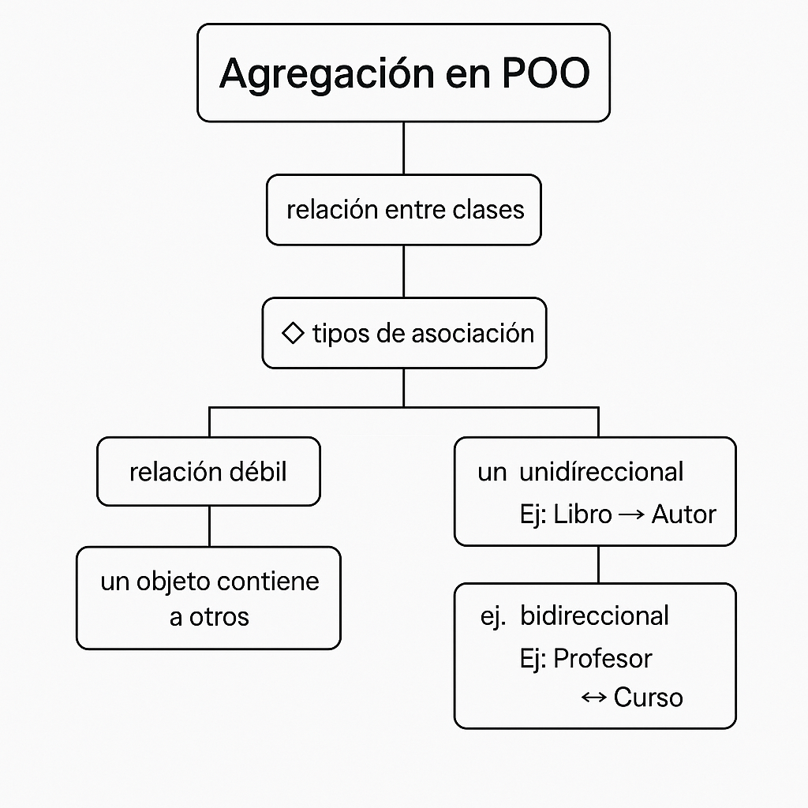
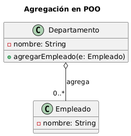

## Mapa conceptual del paradigma Asociacion 🌍

---
## UML Explicativo del paradigma Asociacion ⭐

### Explicacion UML
🎯 Objetivo del diagrama:
- Representar una relación de agregación entre dos clases (```Departamento``` y ```Empleado```) en el contexto de la **Programación Orientada a Objetos (POO) usando UML.**

🧱 Clases del diagrama:
```Departamento```
- Tiene un atributo ```nombre``` (privado).

- Tiene un método ```agregarEmpleado(e: Empleado)``` para asociar empleados al departamento.

- Actúa como **contenedor** en la relación de agregación.

```Empleado```
- Tiene un atributo ```nombre``` (privado).

- Representa los objetos **contenidos** en el departamento.

🔗 Relación: ```Departamento o-- Empleado```
- ```o--``` es el símbolo UML que indica una agregación, también conocida como **"tiene un"** o **"parte de"** (pero débil).

- El rombo blanco en el extremo del ```Departamento``` representa que **puede tener empleados**, pero **no es dueño exclusivo** de ellos.

- La multiplicidad ```"0..*"``` indica que un ```Departamento``` puede tener **cero o más empleados.**

🔑 ¿Por qué es agregación?
- Porque los objetos pueden existir independientemente:

  - Un ```Empleado``` puede existir sin un ```Departamento```.

  - Si el ```Departamento``` desaparece, **los empleados no se eliminan automáticamente**.

- La relación entre las clases es débil: es más una asociación estructural que de dependencia vital.