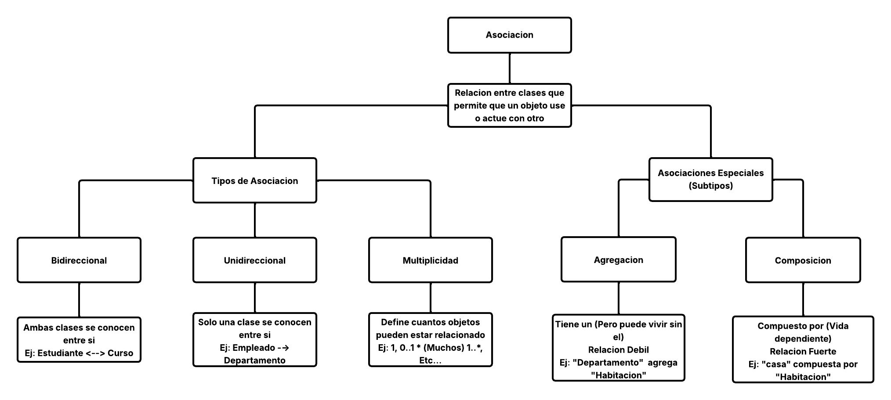
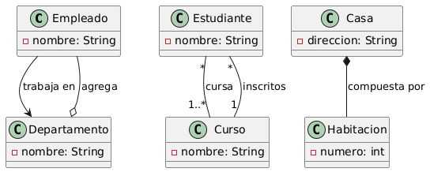

## Mapa conceptual del paradigma Asociacion 🌍

---
## UML Explicativo del paradigma Asociacion ⭐

### Explicacion UML
1. ```Empleado``` → ```Departamento```
- Asociación unidireccional

  - Un Empleado conoce a su Departamento, pero no al revés.


2. ```Curso``` ↔ ```Estudiante```
- Asociación bidireccional

  - Un Curso tiene varios Estudiantes y cada Estudiante puede estar en varios Cursos.

3. ```Departamento``` ◇── ```Empleado```
- Agregación

  - El Departamento agrupa empleados, pero ellos pueden existir sin él.

4. ```Casa``` ◆── ```Habitación```
- Composición

  - Las Habitaciones no existen sin su Casa.