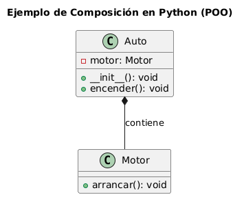

## Mapa conceptual del paradigma Composición 🌍


---

## UML Explicativo del paradigma Composición ⭐


---

### Explicacion UML 📁

####  **Diagrama UML – Composición en Python (POO)**

Este diagrama UML representa un ejemplo básico del paradigma de **composición** en la Programación Orientada a Objetos (POO) usando Python.

#### **Descripción del diseño**

- Se define una clase `Motor` con un método público `arrancar()`.
- La clase `Auto` **contiene** una instancia de `Motor`, lo cual representa una **relación de composición**.
- En la clase `Auto`, se definen los métodos públicos `__init__()` (constructor) y `encender()`, que utiliza el objeto `motor` para ejecutar su funcionalidad.

#### **Relación clave: Composición**

```
Auto *-- Motor : contiene
```