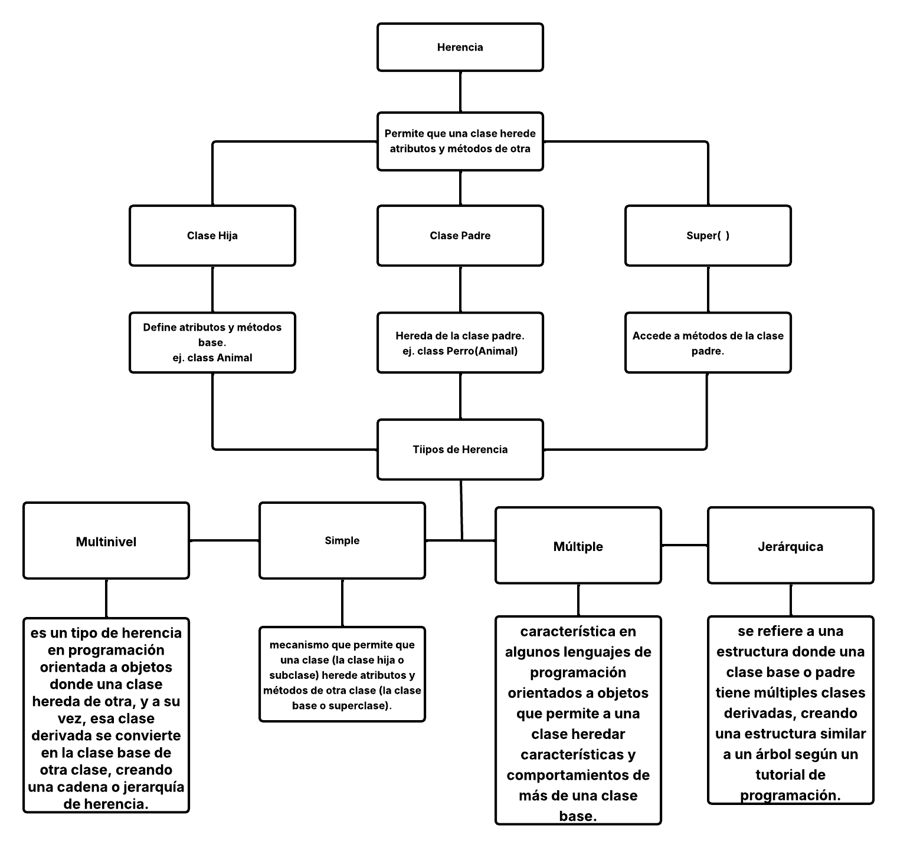
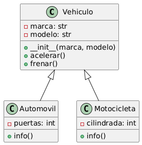

## Mapa conceptual del paradigma Herencia 🌍

---

## UML Explicativo del paradigma herencia ⭐

### Explicación UML
- *Vehiculo* es la superclase con atributos comunes como marca y modelo.

- *Automovil y Motocicleta* son subclases que heredan de Vehiculo.

- Ambas subclases tienen sus propios atributos (puertas, cilindrada) y métodos (info()).

- Los métodos acelerar() y frenar() pueden ser heredados o sobrescritos si es necesario

---

