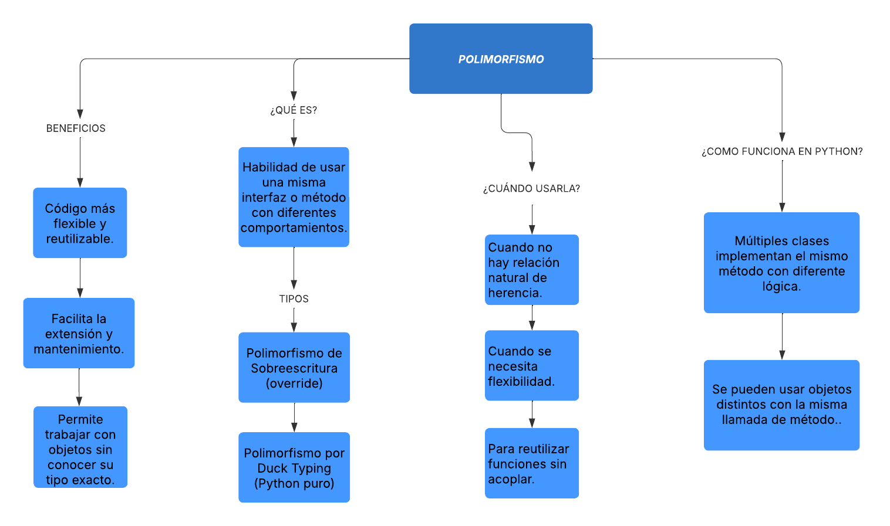
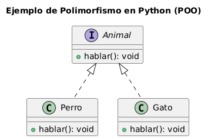

## Mapa conceptual del paradigma Composición 🌍

---

## UML Explicativo del paradigma Polimorfismo ⭐

---

#### **Explicación del Diagrama - Polimorfismo POO**

- `Animal` es una **interfaz** (o clase base en Python) que define un método llamado `hablar()`.

- `Perro` y `Gato` son clases que **implementan** (o sobrescriben) el método `hablar()` de la interfaz `Animal`.

- Aunque el método tiene el mismo nombre, el comportamiento de `hablar()` es diferente en cada clase, lo que demuestra el uso del **polimorfismo**.

