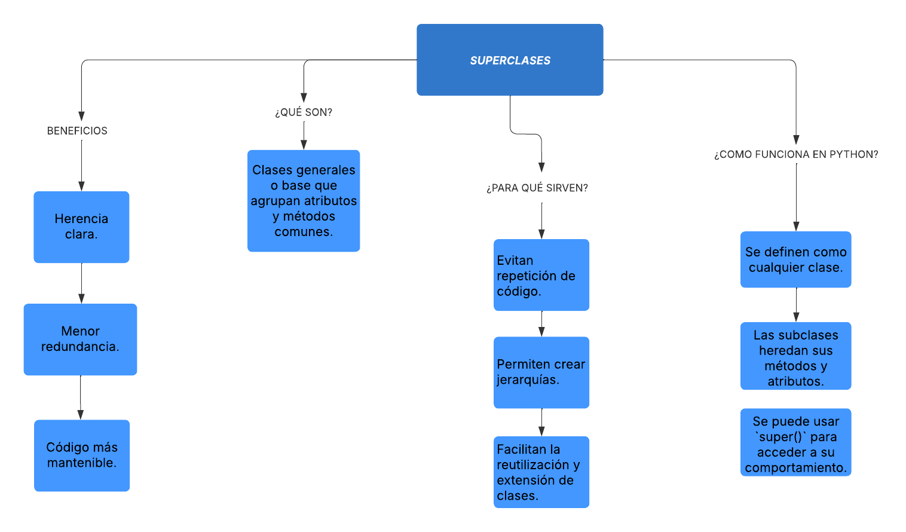
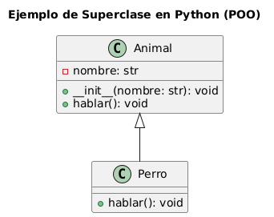

## Mapa conceptual del paradigma Superclases 🌍

---

## UML Explicativo del paradigma Polimorfismo ⭐

---

### **Explicación del Diagrama - Superclases POO**

Este diagrama UML representa cómo una **superclase** (`Animal`) sirve como base para una subclase (`Perro`) en el contexto de la Programación Orientada a Objetos en Python.

---

### ¿Qué es una Superclase?

Una **superclase** (también llamada clase padre o clase base) es una clase **general** que define atributos y comportamientos **comunes** a varias clases más específicas llamadas **subclases**.

En este ejemplo:

- `Animal` es la superclase.
- `Perro` es la subclase que **hereda** de `Animal`.

---

